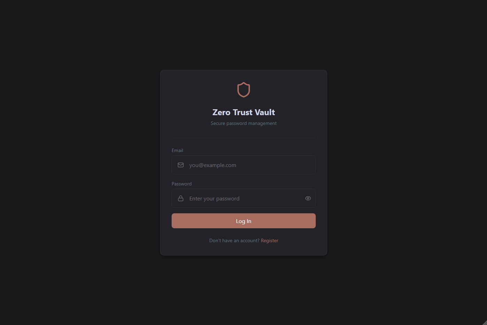
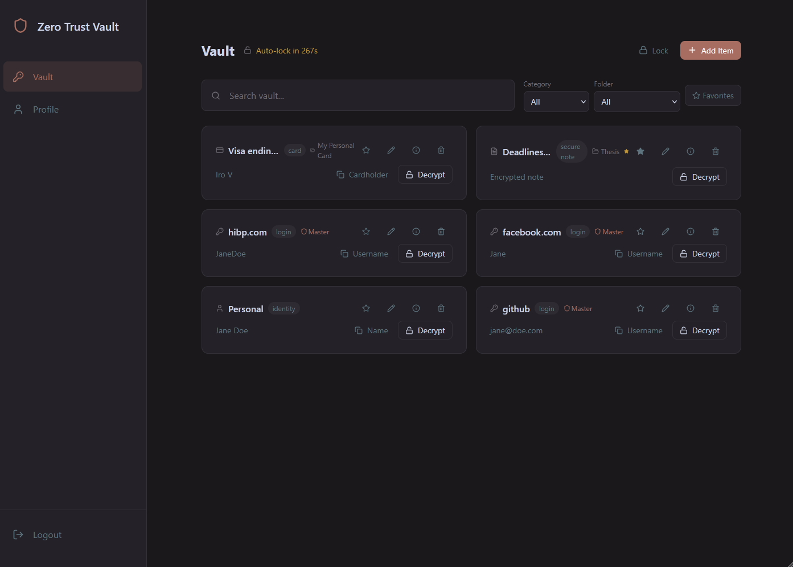
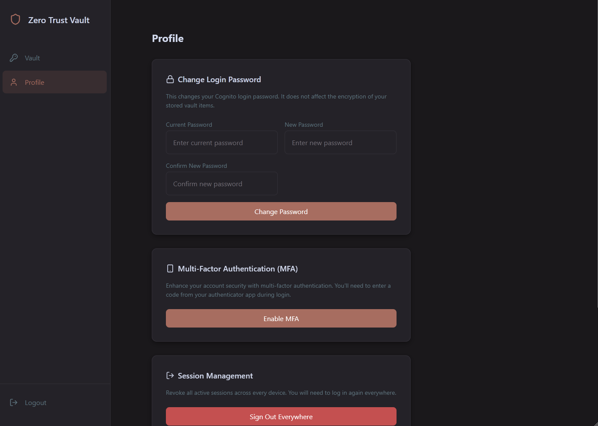

# Zero Trust Password Manager

An end-to-end encrypted, serverless password manager built with React, TypeScript, Terraform, and AWS. The project demonstrates a Zero Trust design for a consumer-style vault: authenticate every request, minimize cloud permissions, assume infrastructure can be compromised, and keep plaintext secrets in the browser only.

> Status: academic/thesis project. Do not store real production secrets unless you have reviewed, hardened, and deployed the stack for your own threat model.

## Screenshots


| Login | Vault | Profile |
| --- | --- | --- |
|  |  |  |

## Why This Exists

Most password managers rely on a simple but powerful security promise: the server should never need to see the user's plaintext secrets. This project implements that idea with browser-side encryption, AWS managed identity, least-privilege Lambda APIs, DynamoDB storage, and optional security monitoring around the cloud boundary.

<details open>
<summary><strong>Feature Highlights</strong></summary>

- Client-side AES-GCM encryption through the Web Crypto API.
- PBKDF2 key derivation with per-item salts.
- Additional authenticated data binds ciphertext to item context.
- Vault support for logins, payment cards, identities, and secure notes.
- Password generation using browser cryptographic randomness.
- Have I Been Pwned password breach checks with k-anonymity.
- Amazon Cognito login, registration, email confirmation, token refresh, and TOTP MFA.
- Automatic inactivity logout and vault memory clearing.
- Per-item decrypt flow, clipboard copy, favorites, folders, filtering, and search.
- Terraform-managed AWS backend with API Gateway, Lambda, DynamoDB, IAM, Cognito, S3, WAF, CloudWatch, GuardDuty, CloudTrail, Security Hub, AWS Config, KMS, and Access Analyzer modules.

</details>

<details>
<summary><strong>Architecture</strong></summary>

```text
React + TypeScript browser app
  - Cognito authentication
  - Web Crypto API encryption/decryption
  - HIBP breach checks
        |
        | HTTPS + JWT
        v
API Gateway HTTP API
        |
        v
Lambda CRUD handlers
        |
        v
DynamoDB encrypted vault records

Supporting controls:
CloudFront/WAF, CloudWatch, S3 audit logs, GuardDuty, CloudTrail,
Security Hub, AWS Config, KMS, IAM Access Analyzer, incident response Lambda.
```

See [doc/architecture.png](doc/architecture.png) for deeper implementation notes.

</details>

<details>
<summary><strong>Tech Stack</strong></summary>

| Layer | Tools |
| --- | --- |
| Frontend | React 19, TypeScript, Vite, CSS Modules |
| UI | CSS Modules, lucide-react, react-qr-code |
| Crypto | Web Crypto API, AES-GCM, PBKDF2, SHA-1 for HIBP range lookup |
| Auth | Amazon Cognito, JWT, TOTP MFA |
| API | API Gateway HTTP API, Lambda |
| Data | DynamoDB, S3 audit log bucket |
| Infrastructure | Terraform modules |
| Security | IAM least privilege, WAF, KMS, GuardDuty, CloudTrail, Security Hub, AWS Config, Access Analyzer |
| Tests | Vitest, happy-dom, Terraform/security scenario tests |

</details>

## Quick Start

### Prerequisites

- Node.js 18 or newer
- npm
- Terraform
- AWS credentials configured for the target account

### 1. Install dependencies

```bash
npm install
```

### 2. Deploy the backend

```bash
cd terraform
terraform init
terraform plan
terraform apply
```

After deployment, collect the frontend values:

```bash
terraform output
```

### 3. Configure the frontend

From the project root:

```bash
cp .env.example .env
```

Fill in:

```env
VITE_API_URL=<api_gateway_api_endpoint or cloudfront_api_endpoint>
VITE_COGNITO_USER_POOL_ID=<cognito_user_pool_id>
VITE_COGNITO_CLIENT_ID=<cognito_client_id>
VITE_AWS_REGION=eu-north-1
```

`VITE_AWS_REGION` is needed by the profile MFA flow because it calls the Cognito Identity Provider endpoint directly.

### 4. Run locally

```bash
npm run dev
```

Open `http://localhost:5173`.

## Available Scripts

| Command | Purpose |
| --- | --- |
| `npm run dev` | Start the Vite development server |
| `npm run build` | Type-check and build the frontend |
| `npm run preview` | Preview the production build locally |
| `npm run lint` | Run ESLint |
| `npm test` | Run the full Vitest suite |
| `npm run test:coverage` | Run tests with coverage output |
| `npm run test:security` | Run security and Terraform scenario tests |
| `npm run test:lambda` | Run Lambda handler tests |
| `npm run test:frontend` | Run frontend service tests |

## Project Structure

```text
src/
  components/         Reusable UI, layout, toast, inputs, cards
  pages/              LoginPage, VaultPage, ProfilePage
  services/           API, Cognito, crypto, HIBP integrations
  utils/              Password validation
terraform/
  lambda-functions/   Node.js Lambda handlers
  modules/            AWS infrastructure modules
tests/
  lambda/             Lambda behavior tests
  security/           Attack scenario and infrastructure tests
docs/
  screenshots/        README screenshots
  *.md                Thesis, project, and deployment documentation
```

## Security Model

<details>
<summary><strong>What the cloud stores</strong></summary>

Vault records are stored as encrypted payloads with the metadata required to retrieve and manage them. Plaintext vault secrets are encrypted before leaving the browser. The backend receives ciphertext, IVs, salts, item metadata, and authenticated user context.

</details>

<details>
<summary><strong>What the browser handles</strong></summary>

The browser derives encryption keys from the user's master password, encrypts new vault entries, decrypts selected entries, checks password strength, performs HIBP range queries, and clears decrypted values after short-lived use.

</details>

<details>
<summary><strong>Important limitations</strong></summary>

- Browser JavaScript cannot provide true guaranteed secure memory wiping.
- A compromised client device or malicious browser extension can still capture secrets.
- The `.env` file must never be committed with real deployment values.
- Cloud security services can add cost; review `terraform/variables.tf` before deploying.

</details>

## License

Created for academic research and demonstration. Add a formal license before distributing or reusing this project outside that context.
